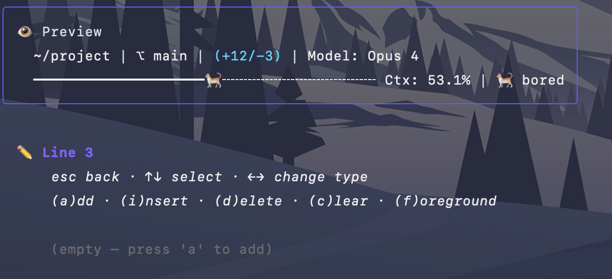
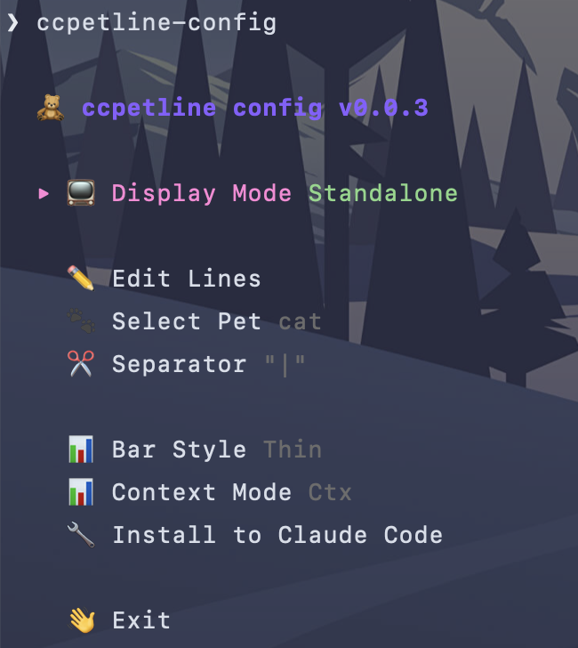
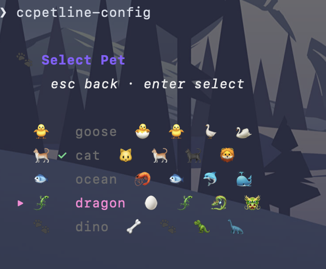

# ccpetline

A terminal pet that lives alongside your Claude Code sessions. It reacts to tool calls and grows fatter as your context window fills up. Highly inspired by [ccstatusline](https://github.com/sirmalloc/ccstatusline).

<p align="center">
  
</p>
<p align="center">
  
  
</p>

## Install

One-liner:

```bash
curl -fsSL https://raw.githubusercontent.com/jansuthacheeva/ccpetline/main/install.sh | bash
```

Or pin a version:

```bash
VERSION=v0.0.1 curl -fsSL https://raw.githubusercontent.com/jansuthacheeva/ccpetline/main/install.sh | bash
```

After installing, run `ccpetline-config` and select **Install to Claude Code** to set up hooks and the status line automatically.

### Manual install

Download the binary for your platform from the [releases page](https://github.com/jansuthacheeva/ccpetline/releases), extract it, and copy the three binaries to a directory in your PATH.

### Build from source

```bash
git clone https://github.com/jansuthacheeva/ccpetline.git
cd ccpetline
make install
```

### Development

```bash
make build   # build the three binaries into bin/
make test    # run the test suite
make lint    # go vet + gofmt check
```

## Features

- **5 pets** -- cat, goose, dragon, dino, ocean creature
- **Style presets** -- one **Nerd Font** toggle drives the whole look: spelled-out text labels or crisp glyphs, and an optional Powerline segment style
- **Highly customizable** -- bar style, width, layout, colors, line templates with tokens
- **Standalone or composable** -- use as a full status line, or prepend/append to an existing one
- **Reactive** -- pet mood and size change dynamically based on tool use and context window fill
- **TUI configurator** -- interactive setup via `ccpetline-config` with a first-run style wizard, no JSON editing needed
- **Zero dependencies** -- single static binaries, no runtime requirements

## Emoji requirements

ccpetline renders pets using emoji and Unicode characters. Your terminal needs:

- An emoji-capable font (most modern terminals work out of the box)
- If emojis don't render correctly, install [Noto Color Emoji](https://fonts.google.com/noto/specimen/Noto+Color+Emoji)
- For best results, use a [Nerd Font](https://www.nerdfonts.com/) which includes extra glyphs

## Style

The **Style** screen in `ccpetline-config` sets your terminal's look in one place. The first
time you run the configurator (no config yet) it opens automatically as a short wizard with a
live preview; afterwards you can re-open it anytime from the **Style** menu item.

A single **Nerd Font** toggle declares whether your terminal has a [Nerd Font](https://www.nerdfonts.com/)
installed. When it's off, only text-safe options are shown. When it's on, three more choices
appear:

- **Icons** -- spelled-out text labels (`Model: Opus 4`, `Joy: 5`, `$0.42`) or monochrome Nerd
  Font glyphs (a microchip for the model, a folder for the directory, a heart for joy, etc.).
  The pet stays a colorful emoji either way.
- **Powerline** -- the segment style described below.
- **Separator** -- the powerline separator glyph (shown only while Powerline is on).

Options that need a Nerd Font are hidden entirely without one, so you can't accidentally pick
something that renders as boxes. Everything is plain Unicode text, so it renders correctly
through Claude Code's status line (unlike terminal image protocols, which it does not support).

Colors are configured separately, per segment, via the color picker in **Edit Lines** (press
`f`). Out of the box the status line uses a default color scheme (blue directory, purple
branch, gold changes, cyan model, green cost, pink joy, and so on); override any segment to
taste. Besides the curated palette, the picker has a **custom hex** entry (press `#` or
select the row below the swatches) that accepts any `#rrggbb` code, rendered as 24-bit
truecolor. In `config.json`, palette colors are stored as ANSI-256 numbers and custom colors
as hex strings, so you can also mix both forms by hand:

```json
"line_colors": [[39, 0, "#ff8800"]]
```

### Powerline

Enable **Powerline** on the **Style** screen to render each segment as a
filled block joined by `` arrows. In this mode the per-segment colors become segment
**backgrounds** and the text color auto-contrasts. Powerline needs a Nerd Font (every Nerd
Font ships the separator glyphs), so the toggle only appears once **Nerd Font** is on.

The separator glyph is configurable via the **Separator** row that appears below the
Powerline toggle: Arrow ``, Round ``, Slant ``, Backslant ``, Flame ``,
Pixels `` or None for a straight edge with no glyph between blocks.

## Architecture

```
Claude Code
  |-- PostToolUse hook -----> ccpetline-hook -----> per-session state file
  |-- SessionStart hook ----> ccpetline-hook ----/   (in the OS temp dir)
  |-- SessionEnd hook ------> ccpetline-hook ---/
  |-- Statusline -----------> ccpetline -> (reads state, renders status line)
```

State files are written atomically to the OS temp directory (`/tmp` on Linux,
the user temp dir on macOS and Windows), one per Claude Code session. Stale
files are cleaned up automatically after two weeks.

Three binaries:

| Binary | Purpose |
|--------|---------|
| `ccpetline` | Statusline command. Reads pet state, renders status line output. |
| `ccpetline-hook` | Hook handler. Reads Claude Code hook JSON from stdin, updates pet state. |
| `ccpetline-config` | TUI configurator. |

## Pet mechanics

| Signal | Source | Effect |
|--------|--------|--------|
| Tool use | PostToolUse hook | +1 joy, mood change |
| Context update | Statusline | Updates fatness (primary size driver) |
| Wake | SessionStart hook | Pet wakes up |
| Sleep | SessionEnd hook | Pet goes to sleep |
| Idle | No events for a few seconds | Gets bored, naps, grooms, wanders |
| Long idle | No events for a minute | Falls asleep |

### Size stages (driven by context window %)

1. **Tiny** (0-20%) -- small, energetic
2. **Normal** (21-35%) -- default
3. **Chonky** (36-60%) -- wider body
4. **Mega chonk** (61-100%) -- very wide, sweating

## Hook config

Add to `~/.claude/settings.json`:

```json
{
  "hooks": {
    "PostToolUse": [{
      "matcher": "*",
      "hooks": [{ "type": "command", "command": "ccpetline-hook", "async": true }]
    }],
    "SessionStart": [{
      "hooks": [{ "type": "command", "command": "ccpetline-hook", "async": true }]
    }],
    "SessionEnd": [{
      "hooks": [{ "type": "command", "command": "ccpetline-hook", "async": true }]
    }]
  },
  "statusLine": {
    "type": "command",
    "command": "ccpetline",
    "padding": 0
  }
}
```

## Testing manually

```bash
# Feed it
echo '{"hook_event_name":"SessionStart"}' | ./bin/ccpetline-hook
echo '{"hook_event_name":"PostToolUse","tool_name":"Bash"}' | ./bin/ccpetline-hook
echo '{"hook_event_name":"SessionEnd"}' | ./bin/ccpetline-hook

# Render status line
echo '{}' | ./bin/ccpetline
```

## Configuration

Run `ccpetline-config` to open the TUI configurator. Config is stored in `~/.ccpetline/config.json`.

Invalid values (unknown species, bar style out of range, and so on) are normalized to
defaults on load. If the file is ever malformed, it is preserved as `config.json.bad`
for manual recovery and defaults are used instead of silently overwriting it.

## License

[MIT](LICENSE)
